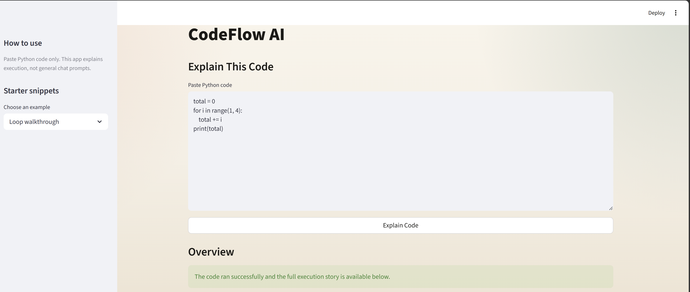
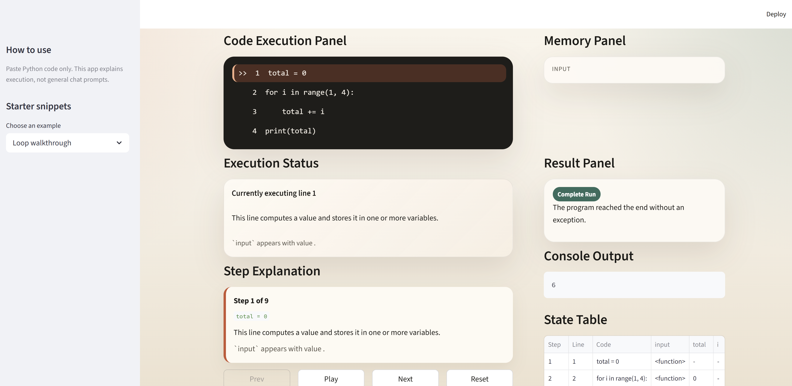
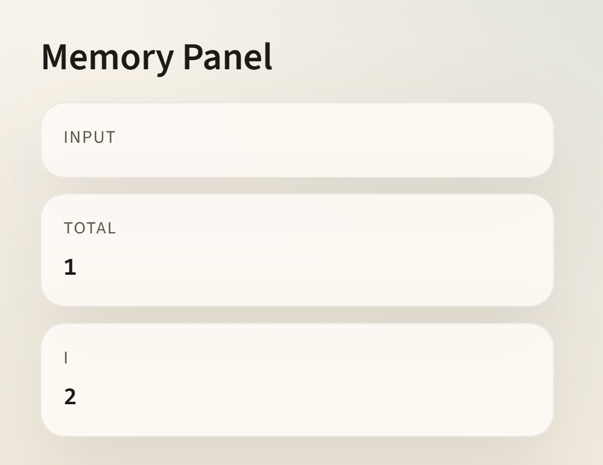
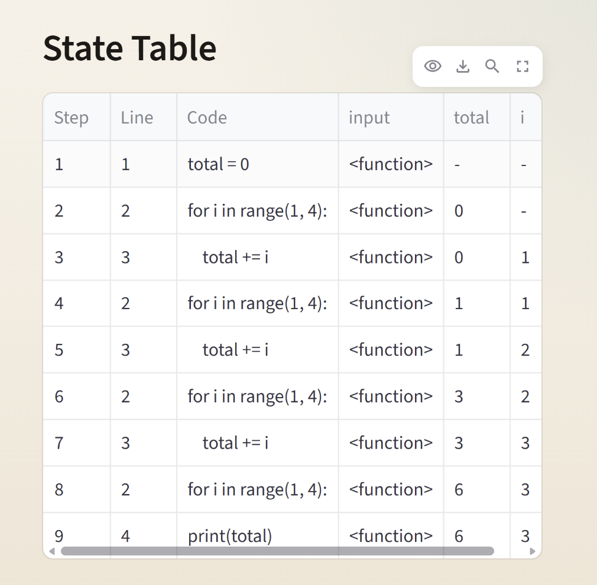
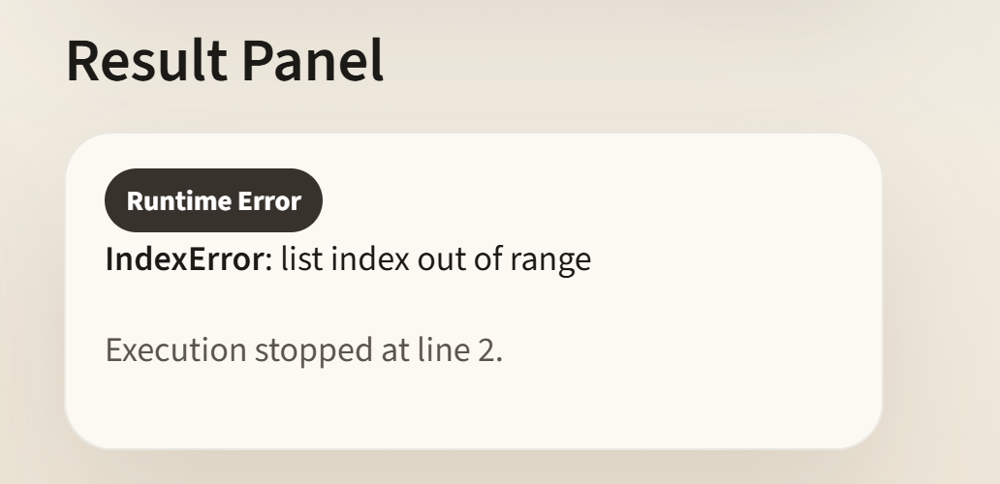

# 🚀 CodeFlow AI


An AI-powered educational tool that visualizes Python program execution step-by-step. CodeFlow AI helps beginners understand program execution through interactive code tracing, memory visualization, state tracking, and detailed error explanations.

---

## 📌 Project Overview

CodeFlow AI executes Python programs in a controlled environment and explains every step of execution. It tracks variable changes, visualizes memory, highlights the currently executing line, and provides beginner-friendly explanations for syntax and runtime errors.

---

## ✨ Features

- 🔍 Line-by-line code execution tracing
- 🧠 Memory visualization
- 📊 State table generation
- ⚠️ Syntax error detection
- 🐞 Runtime error explanation
- ▶️ Play, Pause, Next & Previous controls
- 📤 Console output visualization
- 📥 Automatic input simulation
- 🎯 Beginner-friendly execution explanations

---

## 🛠 Tech Stack

- Python
- Streamlit
- AST (Abstract Syntax Tree)
- `sys.settrace()`
- HTML & CSS

---

## 📸 Screenshots

### Home Page



### Code Execution



### Memory Visualization



### State Table



### Runtime Error



---

## 📂 Project Structure

```text
CodeFlow-AI/
│── assets/
│── app.py
│── README.md
```

---

## ▶️ Run Locally

```bash
git clone https://github.com/likhitha-shasthry/CodeFlow-AI.git
cd CodeFlow-AI

pip install -r requirements.txt
streamlit run app.py
```

---

## ⚙️ Working

1. User enters Python code.
2. Code is parsed using `ast.parse()`.
3. The execution engine runs the code using `compile()` and `exec()`.
4. `sys.settrace()` records every executed line.
5. Local variables are captured after each step.
6. The explanation engine generates step-by-step descriptions.
7. Streamlit displays execution, memory, state table, and console output interactively.

---

## 📈 Future Improvements

- Support multiple programming languages
- AI-powered code suggestions
- Flowchart generation
- Execution analytics dashboard
- Personalized learning recommendations

---

## 👩‍💻 Author

**Likhitha Shasthry B S**

GitHub: https://github.com/likhitha-shasthry
